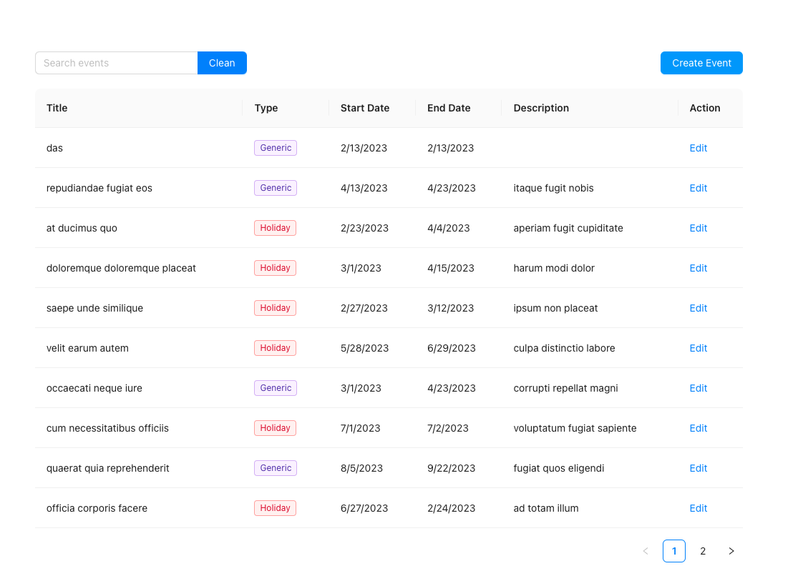
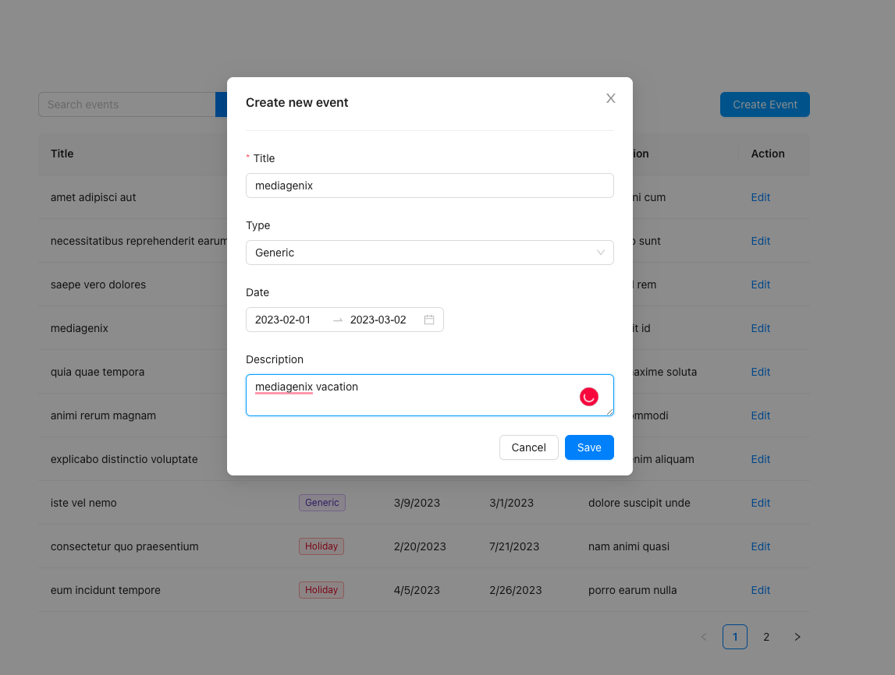
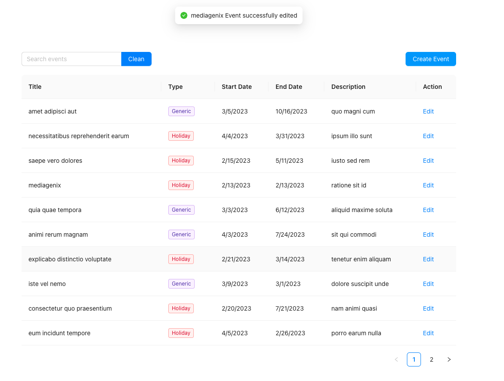
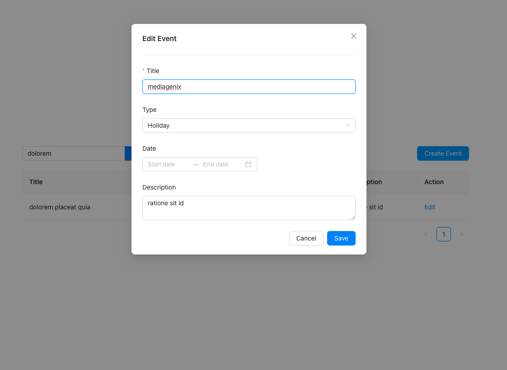
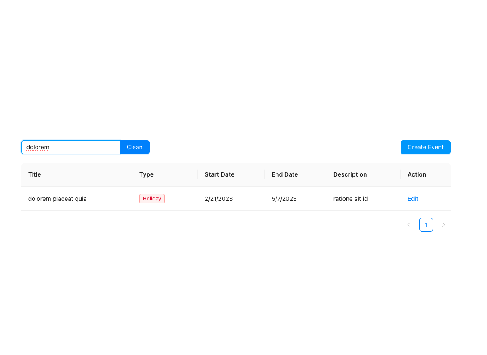

# Mediagenix Event CRUD Challenge

## Available Scripts

Install dependencies 

### `npm install`

In the project directory, you can run:

### `npm run start`

Runs the app in the development mode.\
Open [http://localhost:3000](http://localhost:3000) to view it in the browser.

Here the event page where you can search for events, add events, edit events.

